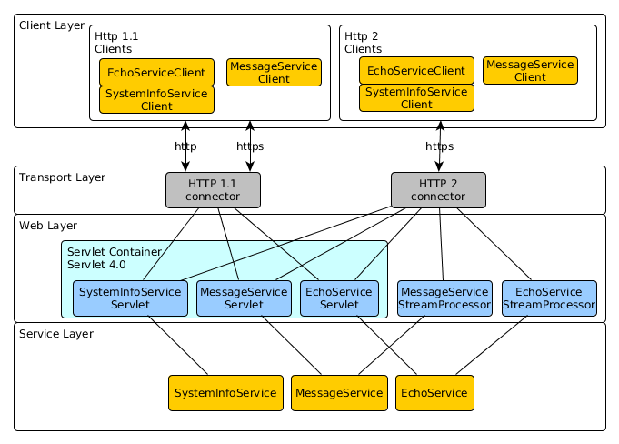

# Jetty HTTP2 server/client demo
This demo shows capabilities of [Jetty](https://www.eclipse.org/jetty/) server 
and [Servlet 4.0 APIs](https://jcp.org/en/jsr/detail?id=369). 
Services deployed in this demo are accessible via via HTT1.1 and HTTP2. 

##Architecture


* __client layer__ - in this demo it is implemented as TestNG integration tests.
                     See package ```itx.examples.jetty.client.*``` and TestNG client tests in ```itx.examples.jetty.tests.*```
* __transport layer__ - jetty is started with two connectors (http1.1 and http2). Http 1.1 communication may use secure and non-secure transport. 
                     Http2 uses only secure transport. See ```itx.examples.jetty.server.ServerBuilder```                       
* __web layer__ - uses servlets and stream processors to access services below. 
                     Servlets are implemented in ```itx.examples.jetty.server.servlet.*``` 
                     and stream processors are implemented in ```itx.examples.jetty.server.streams.*```
                     Stream processors are used for full-duplex communication between client and server.
* __service layer__ - implements some demo services, so there are data available for testing.
                     Services must be thread-safe, because they are accessed from concurrent clients.
                     See ```itx.examples.jetty.server.services.*```.

Server URLs:
```
GET HTTP 1.1 http://localhost:8080/data/system/info
GET HTTP 2.0 https://localhost:8443/data/system/info

GET HTTP 1.1 http://localhost:8080/data/echo/helloworld
GET HTTP 2.0 https://localhost:8443/data/echo/helloworld
```
See also attached postman [file](docs/jetty-http2.postman_collection.json).

##TODO
Http2 stream full-duplex communication is not fully implemented for MassageService.

##Build and Run
For Java8, start JVM with VM option:  
```-Xbootclasspath/p:/opt/alpn-boot-8.1.11.v20170118.jar```  
Build from commandline: ```gradle clean installDist distZip```  
Run server: ```./build/install/jetty-servlet4-http2/bin/jetty-servlet4-http2```

### UnitTesting
When running unit tests in Java8, do not forget to use
-Xbootclasspath JVM option.
